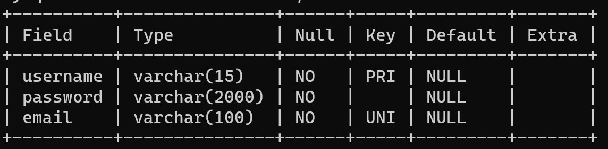
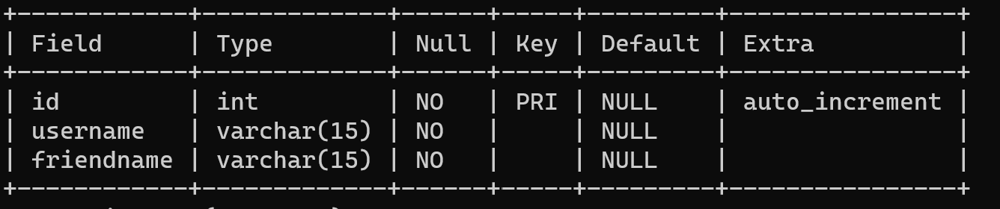
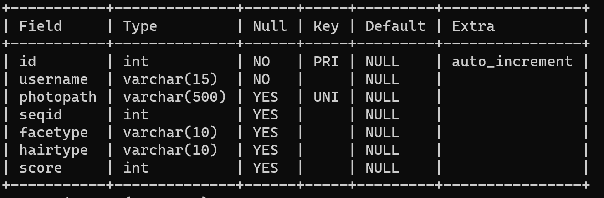
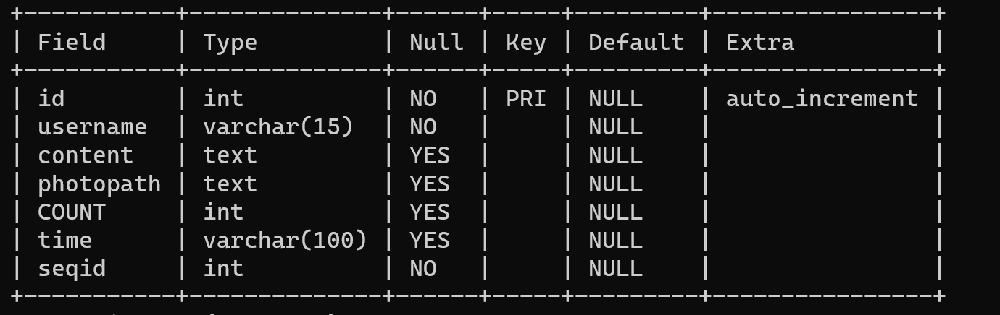

# ReHair
## 环境需求
java 16 2021-03-16

Java(TM) SE Runtime Environment (build 16+36-2231)

Java HotSpot(TM) 64-Bit Server VM (build 16+36-2231, mixed mode, sharing)

Spring CLI v2.5.0-snap-shot

[Redis 5.0.10 for Windows](https://github.com/tporadowski/redis/releases)

MySQL Ver 8.0.24 for Win64 on x86_64

## 传输格式

JSON

图片采用base64编码，去掉编码头部的`data:image/png;base64,`
## 接口

#### for app
1. 登录
* URL: /appLogin
* METHOD: POST
* 请求体：
```
  {
      "username" : 用户名，
      "password" : 密码
  }
```
* 返回值：
``` 
{
    "flag" : true/false,
    "errorMsg" : "" //若成功为空，否则为错误信息
}
```
2. 注册
* URL : /appRegister
* METHOD: POST
* 请求体：
```
{
    "username" : 用户名,
    "password" : 密码,
    "email" : 邮箱
}
```
* 返回值：
```
{
    "flag" : true/false,
    "errorMsg" : "" //若成功为空，否则为错误信息
}
```
3. 获取用户头像
* URL: /getHead
* METHOD: GET
* 请求体： `{ userName: 用户名 }`  
* 返回值：`{ "image" : 图片的base64编码 }`

4. 设置用户头像
* URL： /appSetHead
* METHOD: POST
* 请求体：
```
{
    "username" : 用户名,
    "image" : 图片的Base64编码
}
```

5. 添加好友
* URL： /addFriend
* METHOD: POST
* 请求体：
```
{
    "username" : 用户名,
    "friendName" : 不知道是什么，问wzd
}
```
* 返回值：
```
{
    "flag" : true/false,
    "errorMsg" : "" //若成功为空，否则为错误信息
}
```

6. 发动态
* URL: /createShare
* METHOD: POST
* 请求体：
```
{
    "username" : "用户名",
    "content" : 动态内容,
    "time" : 发布时间，字符串类型， 这种格式："yyyy-MM-dd-hh-mm-ss"
}
```
* 返回值：
```
{
    "flag" : true/false,
    "errorMsg" : "" //若成功为空，否则为错误信息
}
```

7. 动态的图片
* URL: /uploadArticlePhoto
* METHOD: POST
* 请求体:
```
{
    "image" : ["base64编码"， ”base64编码", ....etc]
    
    //将多张图片的base64编码组织成列表的形式
}
```
* 返回值：
```
{
    "flag" : true/false,
    "errorMsg" : "" //若成功为空，否则为错误信息
}
```
8. 获取指定动态：
* URL : /getArticle
* METHOD : GET
* GET参数：`/getArticle?username=clf&start=0&bias=10`

  其中username为用户名，start为起始动态位置，bias是请求额度动态数量，可动态请求数据，类似ajax，只需更改start和bias值
* 返回值：
```
[
    {
        "count": 4,
        "photos": [
            "error.",
            "error."
        ],
        "text": "ssssss",
        "time": "2016-10-27 10:00:00",
        "userName": "clf",
        "seqid" : 1           //seqid是用来标识该用户的的动态的序号，用时间定位简直又臭又长
    },
    {
        "count": 1,
        "photos": [
            base64编码
        ],
        "text": "xxx",
        "time": "2000-10-27 10:00:00",
        "userName": "clf",
        "seqid" : 2
    }
]
```
其中： count为点赞数， photos为图片的base64编码组成的列表，text是文本内容，username是用户名，time是发布时间， 返回值为上述五个参数组成的JSON对象的列表

9. 删除动态
*  URL: /appDeleteArticle
* METHOD: POST
* 请求体：
```
{
  "username" : 用户名,     //后面考虑用session代替
  "seqid" : 序号
}
```
* 返回值：
```
{
    "flag" : true/false,
    "errorMsg" : "" //若成功为空，否则为错误信息
}
```

10. 查看指定用户的动态
* URL: "/userGetArticle"
* METHOD: "GET"
* 请求体： `username=clf&start=0&bias=10`

  其中username为用户名，start为起始动态位置，bias是请求动态数量

11. 修改图片算法               等待与算法部分对接
* URL: /modifyPicture
* METHOD: POST
* 请求体：
```
{
    "username" : 用户名,
    "sourcePhotoName": 源图片名,
    "targetPhotoName": 目标图片名？
    "modifyType" : 修改类型？
    "otherOptions" : 
```
12. 获取脸型模板
* URL: /getTemplatePhoto
* method: GET
* 返回五张图片的编码列表
13. 根据脸型获取发型
* URL: /getHairType
* method: GET
* 参数：faceType
* 返回值: 10张发型图的编码组成的列表

14. 获取用户历史上曾提交过的图片
* URL: /postReHair
* method: GET
* 返回值: 
```
    String faceType;
    String hairType;
    String image;
    int score;
```
组成的列表

#### app 理论上可用的
在app可以操作cookie以让服务器获得用户登录状态的
1. getUser
* method: GET
* 获取当前登录用户名
2. logout
* method: GET
* 用户 注销
3. isFriend
* method: POST
* 判断某一用户是否是自己好友
* 参数：username=name
4. showFriend
* method: GET
* 获取好友列表
5. follow&unfollow
* method: GET
* 实际上为添加和删除好友，参数均为username
6. delAct
* method: GET
* 删号跑路
7. crtShare
* method: POST
* 创建动态，无需先发送文本和时间再发送图片
* 参数：
  {
  "content": 内容,
  "time": 时间,
  "image": 图片, //只测试过一张图片，多张图大概率报错
  "imgType": 图片类型
  }
8. modPic
* method: POST
* 换脸
* 参数:
  {
  "faceType": 脸型
  "hairType": 发型
  "image": 图片编码
  "imgType": 图片类型
  }

* 返回值: 打分及图片编码
9. 、


## Model
1. User
```
class User () {
    public String userName;
    public String passWd;
    public String email;
}
```
2. Article
```aidl
class Article(){
    public String userName;
    public String content;
    public String picturePath;
    public 时间 date;
    public int count;
    list commentList;
}
```
3. Algorithm
```aidl
class Algorithm {
    public static String exchangeFace(String sourcePic, string targetPic;
    public static int recognizeFace(String sourcePic);
    public static String changeColorFace(String sourcePic);
    public static String cutoutFace(String sourcePic);
    public static double scoreFace(String sourcePic);
} 
```


## 数据库
1. User



2. friendlist



3. photo



4. article



## 图片存储路径
```
├─ReHairSource
│  └─admin
│      ├─headPhoto
│      ├─Photo
│      ├─sharePhoto
│      │  └─2021-05-01
│      └─temp
├─static
└─templates
```